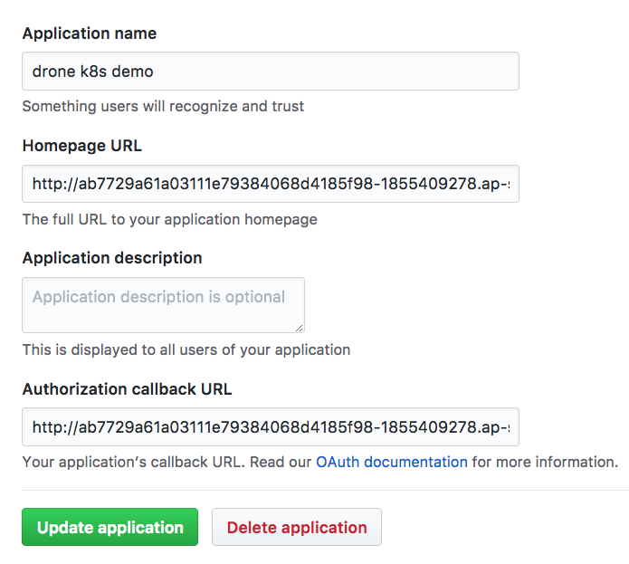

# Drone on Kubernetes on AWS

This directory contains various example deployments of Drone on Amazon Web Services.

**Note: While Drone supports a variety of [different remotes][1], this demo assumes that the projects you'll be building are on [GitHub][2].**

[1]:http://docs.drone.io/installation/
[2]:https://github.com

## Prep work

Before continuing on to one of the example setups below, you'll need to create a Kubernetes cluster, plus a EBS volume for the DB. Here's a rough run-down of that process:

### Create a Kubernetes cluster

You'll want to follow the [Running Kubernetes on AWS EC2][3] guide if you don't already have a cluster.

If you've already got one, make sure your kubectl client is pointed at your cluster before continuing.

[3]:http://kubernetes.io/docs/getting-started-guides/aws/

### Create an EBS volume for your sqlite DB

By default, these manifests will store all Drone state on an EBS volume via sqlite. As a consequence, we need an EBS volume before running the installer.

The easiest way to do this is via the AWS Web Console. It is also possible via the aws CLI's aws ec2 create-volume command. Make sure your volume resides in the same AZ+Region as your cluster! If you aren't sure of what size volume you'll need, 25 GB is a safe bet for most low-to-moderate traffic setups.

```sh
$ aws ec2 create-volume --availability-zone=ap-southeast-1a --size=10 --volume-type=gp2
```

Once you have created your volume, look its Volume ID in the Console/CLI. It should look something like vol-aaaaaa12. You'll want to edit your sample setup's drone-server-rc.yaml file and substitute this for the placeholder value for volumeID. **If you don't do this, your Drone Server will never start**.

open the `drone-server-deployment.yaml` file

```diff
  awsElasticBlockStore:
    fsType: ext4
    # NOTE: This needs to be pointed at a volume in the same AZ.
    # You need not format it beforehand, but it must already exist.
    # CHANGEME: Substitute your own EBS volume ID here.
-   volumeID: vol-xxxxxxxxxxxxxxxxx
+   volumeID: vol-01f13b969e9dabff7
```

### Create drone in AWS

Change the secret key which comunicate between drone server and agent. Open the `drone-secret.yaml` file.

```diff
data:
-  server.secret: REPLACE-THIS-WITH-BASE64-ENCODED-VALUE
+  server.secret: MWYyZDFlMmU2N2Rm
```

Creating a Secret Manually. For example: `1f2d1e2e67df` as server secret key

```sh
$ echo -n "1f2d1e2e67df" | base64
MWYyZDFlMmU2N2Rm
```

Update drone host and GitHub client and secret key in `drone-configmap.yaml`

```yaml
server.host: drone.example.com
server.remote.github.client: xxxxx
server.remote.github.secret: xxxxx
```

create drone via the following commands.

```sh
$ kubectl create -f drone-namespace.yaml
$ kubectl create -f drone-secret.yaml
$ kubectl create -f drone-configmap.yaml
$ kubectl create -f drone-server-deployment.yaml
$ kubectl create -f drone-server-service.yaml
$ kubectl create -f drone-agent-deployment.yaml
```

See the aws LoadBalancer information via the following script:

```sh
$ kubectl --namespace=drone get service -o wide
```

result:

```
NAME            CLUSTER-IP      EXTERNAL-IP
drone-service   100.68.89.117   xxxxxxxxx.ap-southeast-1.elb.amazonaws.com
```

Finally, update the `Homepage URL` and `Authorization callback URL` in `application` of GitHub page.



### Clean up all drone application

```sh
$ kubectl delete -f drone-namespace.yaml
```
